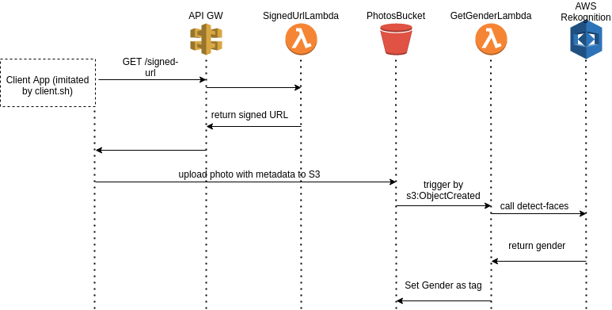

### Description

Test task was: deploy a solution to AWS that allows a client to upload a person's photo with some personal data (name, surname, email, id number).

The backend part should detect a person's gender from the photo and add the gender info to the person's data.

A capability for sustaining up to 10000 req/min should be taken into consideration.

### Implementation

This authored in a very short time (no more than 8 hours, including studying related information).

A very primitive single CloudFormation file is used to deploy the solution.

Because of the time constraints a very dumb approach for the design of the solution is taken - there is no separate data storage for personal data but instead the S3 metadata feature is used to store that. 

Upon a new photo upload a Lambda function is triggered that feeds a photo to AWS Rekognition to obtain person's gender and adds gender info as AWS resource tag to the photo (yes, different parts of a person's info are stored in different places - S3 object metadata and AWS resource tag).

### Flow


### Deploy

#### via CLI

Notice, that API GW is protected by Token Lambda authorizer.

Before deploying the Stack, generate a random string for the token:

```export API_GW_TOKEN=$( cat /dev/urandom | tr -dc 'a-zA-Z0-9' | fold -w 12 | head -n 1 )```

To deploy for the first time, use 

```aws cloudformation create-stack --stack-name <stack name> --capabilities CAPABILITY_IAM CAPABILITY_NAMED_IAM CAPABILITY_AUTO_EXPAND --template-body file://cfn.yaml --parameters ParameterKey=ApiGwToken,ParameterValue=${API_GW_TOKEN}```

To update an existing stack, replace `create-stack` with `update-stack`.

Navigate to the CloudFormation section of the AWS web console to see Stack's state and information.

#### via AWS web console

Generate API_GW_TOKEN.

Navigate to the CloudFormation section of the AWS web console and create a new CFN stack from cfn.yaml. Fill in API_GW_TOKEN value.

### Solution properties

In the `Outputs` section of the CFN stack you can find API Gateway URL and AWS_GW_TOKEN - you need them for passing to the client application simulator (see below).

### Client application

File `client.sh` imitates a client app that first calls API Gateway in order to obtain an unique presigned URL to S3 bucket, then it uses the link to upload a photo file along with person's information. Adjust `client.sh` to your needs. You need to provide a png file depicting a person face. Find the name of the S3 bucket in the `Resources` section of the CFN console and check the uploaded file properties to ensure it has been tagged with a `Gender` tag. 

